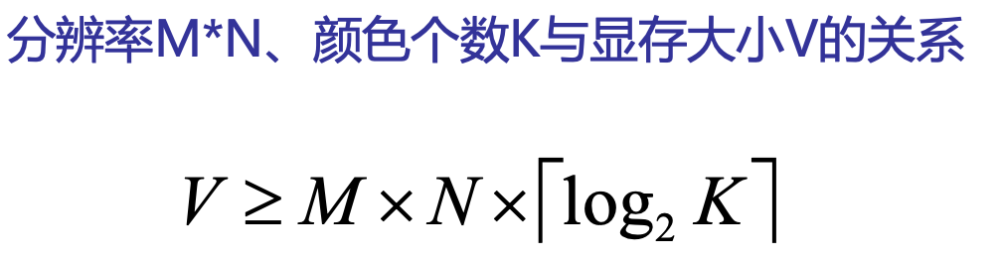
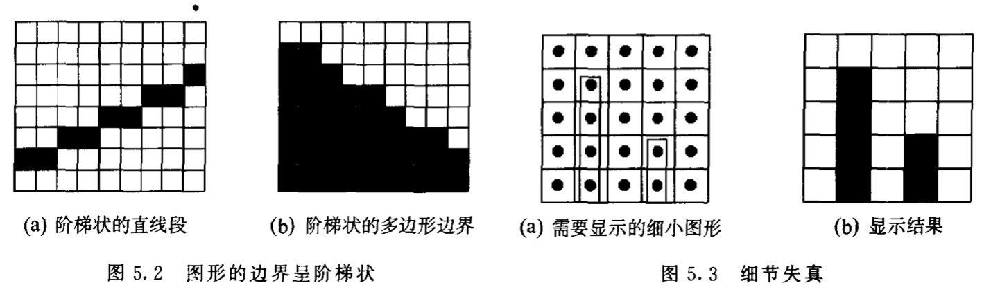
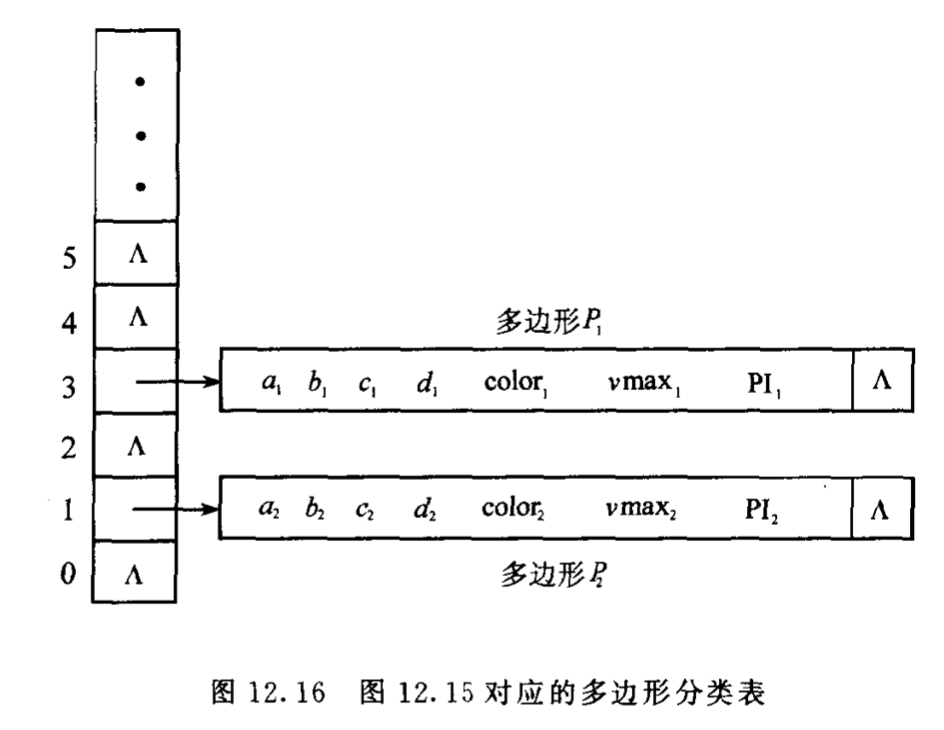
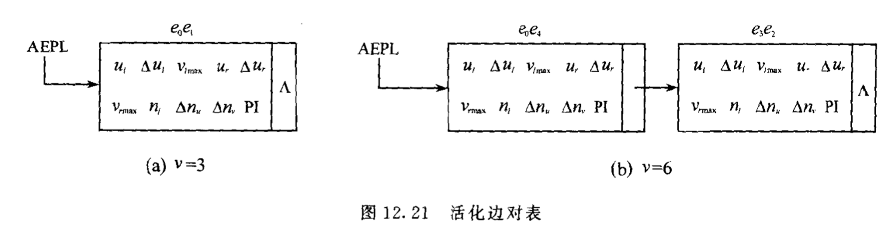
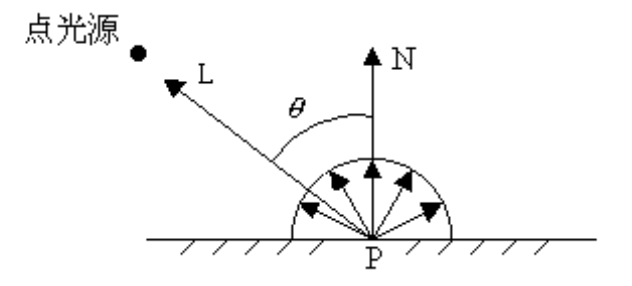

> “📌“ 符号表示该知识点出现在了25春yb老师图形学期末考试中。

## Ch1 绪论

### 1. 研究内容

**计算机图形学**：计算机图形学是研究怎样用数字计算机生成、 处理和显示图形的一门学科。 

**图形**：计算机图形学的研究对象
- 几何要素：刻画形状的点、线、面、体等几何要素。
- 非几何要素：反映物体表面属性或材质的灰度、颜色等非几何要素。
📌 图形分为两类：
- 基于线条信息表示的，如工程图、等高线地图、曲面的线框图等 
- 明暗图(Shading)，也就是通常所说的真实感图形

**表示图形的方法**
- **点阵法**：枚举出图形中所有的点来表示图形，强调图形由点构成，及其点的属性（颜色），即像素图或图象。
- **参数法**：由图形的形状参数和属性参数来表示图形，简称图形 
	- 形状参数：方程或分析表达式的系数，线段的端点坐标等。 
	- 属性参数：颜色、线型等

**图形学与其他学科的关系**
1. 图形学与数字图像处理
	1. 图像和图形的区别
		- 图像纯指计算机内以位图(Bitmap)形式存在的灰度信息数据 
		- 图形更强调几何表示，是由场景的几何模型和景物的物理属性共同组成的 
	2. 图像处理
		研究如何对一幅连续图像取样、量化以产生数字图像，如何对数字图像做各种变换以方便处理；如何滤去图像中的无用噪声 ，如何压缩图像数据以便存储和传输，图像边缘提取，特征增强和提取。
2. 与计算机视觉
	计算机视觉：图形学的逆过程，分析和识别输入的图像并从中提取二维或三维的数据模型（特征）。 
	
	


## Ch2 人眼视觉系统与图形设备

### 2.1 重要概念

#### 颜色视觉

**颜色**是人眼对不同波长的光的能量的感知。
“**光**”是由不同波长的电磁波按照某种能量分布混合叠加而成。
**谱分布**：光在各个可见波长分量的强度分布函数。不同的谱分布函数可能对应为同一种颜色，这种现象被称为“异谱同色”。

**RGB色彩空间**
- 一部分色彩无法表示成 R, G, B 光波的**正**线性组合，这是 RGB 颜色空间的一个缺点。
- 其他色彩空间：
	- **CMY**：采用不同于 RGB 的另外一组基本颜色：Cyan (青)，Magenta (品红)，Yellow (黄)：分别是 R, G, B 的补色。
		- 减色系统（000为白，111为黑），主要应用于被动发光的物体。
		- RGB：加色系统（000为黑，111为白）用于主动发光的物体。
		- 相加色与相减色要生成一样的颜色，数值的bit表示要互补。
	- **HSV**：圆锥形的颜色空间
		- Hue（色调/色相）
		- Saturation（饱和度）
		- Value of Brightness（亮度）

#### 图像和像素

**图像**：$f(x,y)$，二维离散函数。
- 彩色：RGB/RGBA
- 灰度：单值函数

**像素**：图像的定义域，以矩阵形式排列着的格子。

#### 三角网格模型

用于表示三维场景的数据结构：
- 参数曲线和曲面
- 网格模型

**三角网格的定义**

**三角网格**是由一系列欧氏空间中的三维顶点以及连接这些顶点的若干三角面片组成，具体包括：
- 顶点集合 $V = (v_1, v_2, \ldots, v_n)$
- 面片集合 $F = (f_1, f_2, \ldots, f_m)$

其中 $F$ 中的每个面片 $f_i$ 都是由 $V$ 中的顶点构成的空间三角形：
$f_1 = (V_{a_1}, V_{b_1}, V_{c_1}), \quad f_2 = (V_{a_2}, V_{b_2}, V_{c_2}), \ldots$

**法向量**

三角面片的**法向量**是垂直于该三角面片所在平面的非零向量。📌 对于连续可定向的三角网格整体而言，相邻的三角面片需要具备一致的法向量朝向。

**计算**：对周围三角面片取加权平均。


**三角网格的绘制**

- **基于颜色**：指定顶点颜色，对其进行插值得到面片颜色。
- **基于光照**：指定面片材质+光照环境，使用光照模型计算颜色。

### 2.2 人眼视觉系统的频率响应

#### 空间频率

**空间频率**：度量图像平面内图像强度变化的快慢

**表示方法**：
1. 正交方向上的频率（$f_x, f_y$）
	- $f_x$：水平方向单位距离周期数
	- $f_y$：竖直方向单位距离周期数
2. 变化幅度和角度
	$f_m = \sqrt{f_x^2 + f_y^2}, \quad \theta = \arctan(f_y / f_x)$


**角频率**

- 为了解决**空间频率不受观测距离影响**，无法表示人的观测直觉的问题
- 衡量人眼实际感知的图像变化频率（角频率越低，对于人的观测直觉来说观测图像变化越慢）

**计算公式**：
- 视角（$\theta$）**： $$ \theta = 2 \arctan\left(\frac{h}{2d}\right) \ (\text{弧度}) \approx \frac{h}{d} \ (\text{弧度}) = \frac{180}{\pi} \cdot \frac{h}{d} \ (\text{度}) $$
	- $h$为图像物理高度，$d$为观测距离。
	- 当$h \ll d$时，可用近似值$\theta \approx \frac{h}{d}$简化计算。 

- 角频率（$f_{\theta}$）= 空间频率/视角： $$ f_{\theta} = \frac{f_s}{\theta} = \frac{\pi}{180} \cdot \frac{d}{h} \cdot f_s \ (\text{cycle/degree}) $$
	- $f_s$为图像的空间频率（单位：周期/图像高度）。

**特性**
1. 同一图像，观测距离增加，角频率增加。
2. 固定观测距离，屏幕越大，角频率越低。

> [!example]
> 假设某图像空间频率$f_s = 10 \ \text{cycle/mm}$，观测距离$d = 500 \ \text{mm}$，图像高度$h = 50 \ \text{mm}$： 
> 1. 计算视角： $$ \theta \approx \frac{h}{d} = \frac{50}{500} = 0.1 \ \text{radian} = 0.1 \times \frac{180}{\pi} \approx 5.73^\circ $$ 
> 2. 计算角频率： $$ f_{\theta} = \frac{f_s}{\theta} = \frac{10}{0.1} = 100 \ \text{cycle/degree} $$ 表示人眼每度视角内感知到100个强度变化周期。

#### 时间频率

- 测量时间的变化（周期数/s）
- 由运动引起。
- 在视频中，时间频率与空间位置有关，因为每个点都可能发生不同的变化。
- 视频的**最大时间频率**：所有点的时间频率的最大值。

#### 时间频率与空间频率的联系

时间频率是速度矢量在空间梯度矢量上的投影。

📌 假设物体以速度$(v_x, v_y)$匀速运动，则：
$$
f_t = - (v_x f_x + v_y f_y)
$$

当$(v_x, v_y) = 0$时，$(f_x, f_y, f_t)$构成的平面平行于$(f_x, f_y)$。
非零的速度（$(v_x, v_y) = (3,4)$）产生倾斜的平面。此时$f_{t_{max}} = 35$（截距）.

**性质：**
1. If $f_x= f_y=0$, then $f_t = 0$. （如果物体具有完全平坦的图案，那么无论物体在图像平面上移动得多快，都无法观察到任何时间的变化。）
2. 当运动方向与空间频率方向正交时，时间频率=0。（当目标在其图案不变的方向上运动时，不会产生任何时间的变化。）

>[!Example]
> 看一张有 “黑白边缘” 的图（左边黑、右边白）：
> - **空间梯度**：就是 “从黑到白” 的方向，边缘越清晰（黑白变得越快），空间梯度越大。 
> - **像素运动**：如果像素 “垂直于边缘” 运动（比如从黑区往白区跑），这部分速度刚好顺着空间梯度方向 —— 像素会快速从黑变到白，时间频率就高（变化快）。反之，如果像素 “平行于边缘” 运动（沿着黑白交界跑），速度在空间梯度上的投影几乎为 0 —— 像素一直待在黑白交界，亮度没变化，时间频率就低（甚至不变）。
> - “时间频率” 就是 “亮度随时间变没变、变得有多快”。而 **只有像素运动速度中，“顺着亮度变化方向” 的那部分**，才会让亮度在时间上变化。这部分 “顺着亮度变化的速度”，就像把速度 “投影” 到亮度变化的方向上，所以说 “时间频率是速度在空间梯度上的投影” 。 
> - 核心逻辑：亮度变化的方向（空间梯度）决定了 “运动怎么影响时间变化”，只有顺着这个方向的运动，才会让亮度在时间上明显变化。

> [!example]
> （25春 yb 期末）
> $f_x=3$, $f_y=4$, 若物体的运动速率是$5$，求最大时间频率。

#### 人眼视觉系统对频率的响应

##### 时间频率响应和闪烁

- 视觉的时间域响应特性：**视觉惰性**
	
- **临界闪烁频率（CFF）**：约 46Hz，高于此频率时人眼感知为恒定亮度，受平均亮度影响（电视需 60Hz，电影帧率更低）。
##### 空间频率响应

只关注中等细节、优先亮度变化、主动强化边缘、对复杂背景“睁一只眼闭一只眼”

##### 空时响应

- 高时间频率下，空间响应趋近低通（快速运动时难以分辨高频细节）。
- 低时间频率下，空间响应为带通（可以分辨出更高的空间频率）


##### 时空响应

高空间，时间低通（临界闪烁频率下降）；低空间，时间带通。
本质上就是时间和空间同时只能关注好一个。

##### 应用：隔行扫描
隔行扫描提供了空间和时间分辨率之间的折中。降低了视频控制器存取帧缓存的速度及传输带宽的要求。

- 在隔行扫描中，为了在有限的帧率下渲染快速变化的场景，每一帧被分割成两场，每场中的行数为该帧的一半。在快速变化的场景中，眼睛将无法区分非常高的空间频率。
- 当成像场景静止时，两个独立场中的各行结合起来提供高空间分辨率，以适应HVS较高的空间频率分辨能力。

缺点：为什么在近距离看电视时，会感觉到行闪烁?
- 距离越近->角频率越低->临界闪烁频率增加


### 2.3 模拟视频数字化模型


- 直接对连续场景捕捉数字化信号
- 先捕捉模拟信号，再进行取样和量化

#### 抽样定理

**抽样**：把时间上连续的模拟信号变成一系列时间上离散的抽样值的过程。
📌 **抽样定理**：如果对一个频带有限的时间连续的模拟信号抽样，当抽样速率达到一定数值时，那么根据它的抽样值就能**重建原信号**。

**公式**   $$ f_s \geq 2 f_{\text{max}} $$
**采样信号的频谱**
$$\hat{X}(j\Omega) = \frac{1}{T} \sum_{k=-\infty}^{\infty} X(j\Omega - jk\Omega_s)$$

> 采样后的信号频谱，是原始信号频谱 $X(j\Omega)$ 以采样角频率 $\Omega_s$ 为间隔的周期延拓。


**混叠条件**
**混叠**：高频信号被错误地重建为低频信号，例如车轮在视频中看似倒转。
]
  $$ \text{若 } f_s < 2 f_{\text{max}}, \text{ 则发生混叠} $$
📌 **序列卷积**

对于两个离散时间信号 $x_1(n)$、$x_2(n)$，它们的**线性卷积**定义为：
$$
y(n) = \sum_{m=-\infty}^{+\infty} x_1(m) \cdot x_2(n - m)
$$
这表示在每个时刻 $n$，输出 $y(n)$ 是 $x_1$ 与 $x_2$ 经过翻转平移之后的加权和。

>[!example]
> 25春 期末考了一道类似的题。
> 
> 
>
| $n$ | 计算项                                                                                                                           | 累加结果 |
| --- | ----------------------------------------------------------------------------------------------------------------------------- | ---- |
| 0   | $x_1(0) \cdot x_2(0) = 1 \cdot 1 = 1$                                                                                         | 1    |
| 1   | $x_1(0) \cdot x_2(1) = 1 \cdot 0 = 0$  <br> $x_1(1) \cdot x_2(0) = 2 \cdot 1 = 2$                                             | 2    |
| 2   | $x_1(0) \cdot x_2(2) = 1 \cdot 1 = 1$  <br> $x_1(1) \cdot x_2(1) = 2 \cdot 0 = 0$  <br> $x_1(2) \cdot x_2(0) = 1 \cdot 1 = 1$ | 2    |
| 3   | $x_1(1) \cdot x_2(2) = 2 \cdot 1 = 2$  <br> $x_1(2) \cdot x_2(1) = 1 \cdot 0 = 0$                                             | 2    |
| 4   | $x_1(2) \cdot x_2(2) = 1 \cdot 1 = 1$                                                                                         | 1    |

**卷积的性质**：

| 性质      | 说明                                          |
| ------- | ------------------------------------------- |
| **交换性** | $x_1 * x_2 = x_2 * x_1$                     |
| **结合性** | $x_1 * (x_2 * x_3) = (x_1 * x_2) * x_3$     |
| **分配性** | $x_1 * (x_2 + x_3) = x_1 * x_2 + x_1 * x_3$ |

**序列的能量**
对于离散序列 $x(n)$，其总能量 $E$ 定义为所有样值的模平方和：
$$
E = \sum_{n = -\infty}^{\infty} |x(n)|^2
$$
> 解释：这个定义与物理中的能量含义一致，它反映的是序列整体“大小”的累积。对有限长度序列，它等价于将每个值平方后加总。


**反混叠前置滤波器**  
对于输入的模拟信号，先过滤其中频率过高的部分，保证过滤后的信号$f_{max}<\cfrac{f_s}{2}$，防止混叠。


### 2.4 图形设备

**图形显示设备**
- 图形输出（屏幕输出）
- 图形绘制（打印）

#### 图形显示器

- **阴极射线管（CRT）**
	- 某种CRT产生稳定图像所需要的最小刷新频率=1秒/荧光物质的持续发光时间
		例如：一种荧光物质持续光时间40毫秒，刷新频率为1000/40=25帧/秒，发光时间短，适用于动态图形显示。发光时间长，适用于静态图形显示。
- **彩色阴极射线管**
	- 射线穿透法
	- 影孔板法
- **光栅扫描系统**
	
	- 帧缓冲存储器（显存）：存储屏幕上像素的颜色值
		
	- 黑白光栅扫描显示器
		
		数模转换器：用于把数字信号（帧缓存）转换到模拟设备（CRT）
	- 彩色光栅扫描显示器
		三个位面的帧缓存（八种颜色）
		
		
		
	- **显示处理器**
		- 任务：扫描转换待显示的图形。

#### **相关概念**
- **行频**：水平扫描频率，是电子枪每秒在屏幕上扫描过的水平线条数。
- **帧频**：垂直扫描频率，是每秒钟屏幕重复绘制显示画面的次数，即重绘率。
- **亮度等级（灰度）**：单色显示器的亮度变化
- **色彩**：可选择显示器颜色的数目以及一帧画面可同时显示的颜色数
- **带宽**：每秒钟扫描的象素个数；即单位时间内每条扫描线上显示的象素数总和。
- **显示速度**：显示字符、图形特别是动态图像的速度，与显示器的分辨率及扫描频率有关。可用最大带宽表示

**LCD显示器**


## Ch3 直线、圆、椭圆生成算法

图形的光栅化流程：
1. 确定有关像素
2. 写像素
	1. 一维：用一个像素宽的直线显示图形
	2. 二维：填色像素集
	3. 裁剪
3. 扫描转换

- 先裁剪再扫描转换：节约计算时间
- 反之：算法简单。


> 📌 （意外地）这些看上去很复杂的算法今年都没有考（）
### 一、直线段的扫描转换算法

确定最佳逼近于该直线的一组象素，并且按扫描线顺序，对这些象素进行写操作。

#### 1. 数值微分(DDA)法

**算法：**
1. 计算斜率 \( k \)：
   $$
   dx = x_1 - x_0, \quad dy = y_1 - y_0, \quad k = \frac{dy}{dx}
   $$
2. 确定步长方向：
    - 若 $|k| \leq 1$，以$x$为步长（每步$x += 1$，$y += k$）。
    - 若 $|k| > 1$，以$y$为步长（每步$y += 1$，$x += \frac{1}{k}$）。
    
    需要考虑斜率大小是因为，如果用另外一个轴的坐标座位步进方向，生成的直线会少很多像素点（丢失精度）。
    
3. 四舍五入取整：  
    对$y$或$x$值四舍五入，得到实际绘制的像素坐标。

**伪代码（斜率小于1的情况）**：
```c++
void DDALine(int x0, int y0, int x1, int y1, int color) 
{
    int x;
    float dx, dy, y, k;
    dx = x1 - x0;
    dy = y1 - y0;
    k = dy / dx;
    y = y0;
    
    for (x = x0; x <= x1; x++) 
    {
        drawpixel(x, (int)(y + 0.5), color); // 四舍五入取整
        y = y + k;
    }
}
```

**缺点**：
- $y$ 和 $k$ 必须是float，且每一步都必须对$y$进行舍入取整，不利于硬件实现。

#### 2. 中点画线法

**原理**
假设当前点是$(x_p, y_p)$，则下一个点只可能是 $(x_p+1, y_p)$ 或 $(x_p+1, y_p+1)$ 。通过判断直线在$x=x_p+1$时的$y$值与哪个更接近，来确定下一个点应该是哪个点。


判别一个点和直线$F(x,y)$的相对关系：
- $F(x,y) = 0$：点在直线上
- $F(x,y) > 0$：点在直线上方
- $F(x,y) < 0$：点在直线下方

定义**决策变量** $d$，用于判断下一个像素：
$$
d = F(M) = F(x_p + 1, y_p + 0.5)
$$
其中 $M$ 是候选像素 $(x_p+1, y_p)$ 和 $(x_p+1, y_p+1)$ 的中点。

- **若 $d < 0$**：中点在直线下方，选择上方像素 $(x_p+1, y_p+1)$。
- **若 $d \geq 0$**：中点在直线上或上方，选择下方像素 $(x_p+1, y_p)$。

**递推优化**

$F(x,y)=ax+by+c$ 代入两端点$(x_0,y_0),(x_1, y_1)\Rightarrow a=y_0-y_1$, $b=x_1-x_0$.

直线上第一个点是$(x_0,y_0)$，其对应的下一个中点是$(x_0+1, y_0+\cfrac{1}{2})$.

- **初始值**：$$
  d_0 = F(x_0+1,y_0+\cfrac{1}{2})=F(x_0, y_0)+a+\frac{1}{2}b=a+\frac{1}{2}b \xrightarrow{\times2}  2a + b
  $$
- **递推规则**：
	- 这里递推，是在用根据$x$选$x+1$的时候的$d$，推出根据$x+1$选$x+2$的时候的$d$. 而选择$x+2$时，其中点坐标根据$x+1$的纵坐标的不同而改变，因此需要分类讨论。
	- 将结果$\times 2$以确保所有的计算都使用整数。
	- 若 $d < 0$（中点在直线下方，选择 $(x+1,y+1)$），新中点为$(x+2, y+\cfrac{3}{2})$：$$
    \Delta d =F(x+2, y+\cfrac{3}{2})-F(x+1, y+\cfrac{1}{2}) = a+b \xrightarrow{\times 2} 2(a+b)
    $$
    - 若 $d \geq 0$（中点在直线上方，选择 $(x+1,y)$），新中点为$(x+2, y+\cfrac{1}{2})$：$$
    \Delta d =F(x+2, y+\cfrac{1}{2})-F(x+1, y+\cfrac{1}{2}) = a \xrightarrow{\times 2} 2a
    $$
**算法步骤**
1. 计算 $a = y_0 - y_1$，$b = x_1 - x_0$。
2. 初始化 $d = 2a+b$，$y = y_0$。
3. 从 $x = x_0$ 到 $x_1$，逐步绘制像素：
   - 若 $d < 0$：选 $(x+1, y+1)$，更新 $d = d + 2(a+b)$。
   - 否则：选 $(x+1, y)$，更新 $d = d + 2a$。

**伪代码**

```c
void MidpointLine(int x0, int y0, int x1, int y1, int color) {
    int a, b, d1, d2, d, x, y;
    a = y0 - y1;
    b = x1 - x0;
    d = 2 * a + b;       // 初始决策变量
    d1 = 2 * a;          // 当d >= 0时的增量
    d2 = 2 * (a + b);    // 当d < 0时的增量
    
    x = x0;
    y = y0;
    drawpixel(x, y, color);
    
    while (x < x1) {
        if (d < 0) {
            x++;
            y++;
            d += d2;
        } else {
            x++;
            d += d1;
        }
        drawpixel(x, y, color);
    }
}
```

>[!note]
>注意这里的$d$和距离没有任何关系，只是作为一个判别式。从算法的原理上来说，我们每次是计算一个新的中点并把它带入直线方程，但是这个迭代更新$x$和$y$的做法已经被我们用迭代更新$d$的算法替代了。后者对于$d$的计算不依赖于具体的当前$x$和$y$，只和固定的$x_0,x_1,y_0,y_1$有关，所以一开始可以先计算好它们而不是在循环中更新它们。

#### 3. Bresenham画线算法

> [!note]
> Bresenham 算法使用误差项的累积值，通过比较误差项与阈值决定下一个像素点；中点画线算法使用中点处直线方程的符号，通过判断中点相对于直线的位置来决策。区别在于决定下一个像素点的方法，推导过程不同，但是从数学本质上来说是相同的，参数的更新方法也相同。

**算法原理**

假设$(x_p, y_p)$是已经画好了的整数点，下一个点只可能是 $(x_p+1, y_p)$ 或 $(x_p+1, y_p+1)$ 。

考虑直线$y=f(x)$。判断$x=x_p+1$时，$y_p+\cfrac{1}{2}$与$f(x_p+1$)的大小关系：
- $y_p+\cfrac{1}{2} \ge f(x_p+1)\Rightarrow$ 下一个点的真实值在中点下方，应画$(x_p+1, y_p)$.
- $y_p+\cfrac{1}{2} < f(x_p+1)\Rightarrow$ 下一个点的真实值在中点上方，应画$(x_p+1, y_p+1)$.

定义决策变量 $d$，用于判断下一个像素：
$$
d = f(x_p+1)-(y_p+\cfrac{1}{2})
$$

- 若 $d < 0$：选择上方像素 $(x_p+1, y_p+1)$。
- 若 $d \geq 0$：选择下方像素 $(x_p+1, y_p)$。

**递推优化**

直线斜率 $k=\cfrac{y_1-y_0}{x_1-x_0}=\cfrac{\Delta y}{\Delta x}$.

直线上第一个点是$(x_0,y_0)$，其对应的下一个中点是$(x_0+1, y_0+\cfrac{1}{2})$.

- **初始值**：$$
  d_0 = f(x_0+1)-(y_0+\frac{1}{2})=k+\frac{1}{2}=\cfrac{\Delta y}{\Delta x} -\frac{1}{2}\xrightarrow{\times2\Delta x}  2\Delta y-\Delta x
  $$
- **递推规则**：
	- 若 $d < 0$（中点在直线下方，选择 $(x+1,y+1)$），新中点为$(x+2, y+\cfrac{3}{2})$：$$
    \Delta d =f(x+2)-(y+\cfrac{3}{2})-(f(x+1)-(y+\cfrac{1}{2})) = k-1 \xrightarrow{\times 2\Delta x} 2(\Delta y-\Delta x)
    $$
    - 若 $d \geq 0$（中点在直线上方，选择 $(x+1,y)$），新中点为$(x+2, y+\cfrac{1}{2})$：$$
    \Delta d =f(x+2)-(y+\cfrac{1}{2})-(f(x+1)-(y+\cfrac{1}{2})) = k \xrightarrow{\times 2\Delta x} 2\Delta y)
    $$
- 算法步骤和伪代码参考中点画线法。

### 二、圆的扫描转换算法

利用圆的对称性，讨论第二个八分圆。

#### 1. 角度DDA法
低效，省略
#### 2. 中点画圆法

定义**决策变量** $d$，用于判断下一个像素的位置：
$$
d = F(M) = F(x_p + 1, y_p - 0.5)
$$
其中 $M$ 是候选像素 $(x_p+1, y_p)$ 和 $(x_p+1, y_p-1)$ 的中点，$F(x,y)$ 是圆的隐式方程：
$$
F(x,y) = x^2 + y^2 - r^2
$$
- **若 $d < 0$**：中点在圆内，选择上方像素 $(x_p+1, y_p)$。  
- **若 $d \geq 0$**：中点在圆外或圆上，选择下方像素 $(x_p+1, y_p-1)$。

**递推优化：**

- **初始值**：  $$
  d_0 = 1.25 - r
  $$
- **递推规则**：
  - **若 $d < 0$**（选择 $y$ 不变）：    $$
    d_{\text{new}} = d + 2x + 3
    $$
  - **若 $d \geq 0$**（选择 $y-1$）：    $$
    d_{\text{new}} = d + 2(x - y) + 5
    $$
同样可以通过$\times 4$转换成整数。

**伪代码实现**
```c
void MidpointCircle(int r, int color) {
    int x, y;
    float d;
    x = 0; 
    y = r; 
    d = 1.25 - r;
    drawpixel(x, y, color);
    
    while (x < y) {
        if (d < 0) {
            d += 2 * x + 3;
            x++;
        } else {
            d += 2 * (x - y) + 5;
            x++;
            y--;
        }
        drawpixel(x, y, color); 
    }
}
```

>[!note]
>这里 $d$ 和 $x_p, y_p$ 相关了；
>注意 $x$ 加 $y$ 减。
#### 3. Bresenham画圆算法

**原理**

和画线法相同，但是判断条件为：当 $x_{\text{hi}}^2 + y_{\text{hi}}^2 - R^2 \geq R^2 - (x_{\text{li}}^2 + y_{\text{li}}^2)$ 时，应该取 $L_i$；否则取 $H_i$。

 

#### 4. 生成圆弧的正负法

**原理**
对于圆的第二个八分弧，向右 == 向外；向下 == 向内。通过判断当前点$(x_p, y_p)$在圆内还是圆外，来确定下一个点要在圆内还是圆外。

**算法**
初始值：$d = F(x_0, y_0)$

迭代：
- $d <= 0$（在圆内，向外）：画$(x_p+1, y_p)$；$d_{new} = d+2x_p+1$.
- $d > 0$（在圆外，向内）：画$(x_p, y_p-1)$；$d_{new} = d-2y_p+1$.

>[!note]
>注意正负法是选择 $(x_p+1, y_p)$ 或 $(x_p, y_p-1)$，但是中点和Bresenham是选$(x_p+1, y_p)$ 或 $(x_p+1, y_p-1)$.

#### 5. 生成圆弧的多边形逼近法

##### 5.1 圆的内接正多边形迫近法

**原理**：当一个正多边形的边数足够多时，该多边形可以和圆无限接近 => 用正多边形近似圆。

**公式**


- 旋转矩阵递推：$$
  \begin{bmatrix}
  X_{i+1} \\
  Y_{i+1}
  \end{bmatrix}
  =
  \begin{bmatrix}
  \cos a & -\sin a \\
  \sin a & \cos a
  \end{bmatrix}
  \begin{bmatrix}
  X_i \\
  Y_i
  \end{bmatrix}
  $$
- 展开式：$$
  X_{i+1} = X_i \cos a - Y_i \sin a, \quad Y_{i+1} = X_i \sin a + Y_i \cos a
  $$
- 初始值：$$
  X_0 = r, \quad Y_0 = 0, \quad a = \frac{2\pi}{n}
  $$

**复杂度**
- 预计算：仅需计算一次 $\cos a$ 和 $\sin a$。
- 每顶点计算：4 次乘法（$X_i \cos a$, $Y_i \sin a$, $X_i \sin a$, $Y_i \sin a$）和 2 次加法。
- 总乘法次数：$4n$ 次（$n$ 个顶点）。

> [!example]
> 📌 25春考了一道判断圆的**外切**正多边形面积是否大于圆的面积的判断题。

##### 5.2 圆的等面积正多边形迫近法

**目的**：使近似代替圆的正多边形和圆之间在面积上相等 => 需要使该正多边形和圆弧相交，称之为圆的等面积正多边形。

**步骤：**

1. 求多边形径长$$
	\frac{1}{2} n r_p^2 \sin\left(\frac{2\pi}{n}\right) = \pi R^2 \Rightarrow r_p = R \cdot \sqrt{\frac{2\pi}{n \sin\left(\frac{2\pi}{n}\right)}}$$
    $r_p$：等面积多边形的外接圆的半径，即“径长”，$\neq R$.

2. 计算所有顶点坐标 $$
    \theta_k = \frac{2\pi k}{n}, \quad (x_k, y_k) = \left(r_p \cos(\theta_k),\ r_p \sin(\theta_k)\right) \quad \text{for } k = 0,1,\dots,n-1
$$

### 四、椭圆的扫描转换

**标准椭圆方程**：  
  $F(x,y) = b^2x^2 + a^2y^2 - a^2b^2 = 0$

**法向量**
- 椭圆上一点 $(x, y)$ 处的法向量：  $$
	N(x, y) = N_x \mathbf{i} + N_y \mathbf{j} = \frac{\partial F}{\partial x} \mathbf{i} + \frac{\partial F}{\partial y} \mathbf{j} = 2b^2x \mathbf{i} + 2a^2y \mathbf{j}$$
- 利用椭圆的对称性，只需生成第一象限的椭圆弧。
- 将第一象限椭圆弧分为上下两部分，分界点为切线斜率为$-1$的点。


1. 上半部分法向量的 $y$ 分量较大；
2. 下半部分法向量的 $x$ 分量较大。
3. 分界点：当不等式方向改变时，说明椭圆弧从上半部分转入下半部分。满足：
$$
2b^2 x \geq 2a^2 y
$$
#### 椭圆的中点画法

**隐式函数形式**：
$$
F(x,y) = b^2 x^2 + a^2 y^2 - a^2 b^2 = 0
$$

- $F(x,y) = 0$：点在椭圆上  
- $F(x,y) > 0$：点在椭圆外  
- $F(x,y) < 0$：点在椭圆内  

- 区域1：斜率 $|k| \leq 1$，沿 $x$ 步进  
- 区域2：斜率 $|k| > 1$，沿 $y$ 步进  

仅需绘制第一象限，对称到四个象限。

**区域1 决策变量 $d_1$**

**初始值：**
椭圆弧起点为$(0,b)$ => 中点为 $(1,b-0.5)$.
$$
d_1 = b^2 - a^2 b + 0.25 a^2
$$
**更新规则：**

中点为 $(x_p+1, y_p - 0.5)$，$d_1 = F(x_p+1, y_p - 0.5)$.

- 若 $d_1 < 0$，取$(x_p+1, y_p)$，
$$
  d_1 = d_1 + b^2 (2x_p + 3)
$$

- 否则，取$(x_p+1, y_p-1)$，$$
  d_1 = d_1 + b^2 (2x_p + 3) + a^2 (-2y_p + 2)
  $$

**区域2 决策变量 $d_2$**

中点为 $(x_p + 0.5, y_p - 1)$，决策变量为：
$$
d_2 = F(x_p + 0.5, y_p - 1) = b^2 (x_p + 0.5)^2 + a^2 (y_p - 1)^2 - a^2 b^2
$$

更新规则：
- 若 $d_2 < 0$，取$(x_p+1, y_p-1)$，$$
  d_2 = d_2 + b^2 (2x_p + 2) + a^2 (-2y_p + 3)
  $$
- 否则，取$(x_p, y_p-1)$，$$
  d_2 = d_2 + a^2 (-2y_p + 3)
  $$

**伪代码**
```cpp
void MidpointEllipse(int a, int b, int color) {
    int x, y;
    float d1, d2;
    x = 0;
    y = b;
    d1 = b * b + a * a * (-b + 0.25);
    putpixel(x, y, color);
    
    // 区域1：斜率 |k| <= 1
    while (b * b * (x + 1) < a * a * (y - 0.5)) {
        if (d1 < 0) {
            d1 += b * b * (2 * x + 3);
            x++;
        } else {
            d1 += b * b * (2 * x + 3) + a * a * (-2 * y + 2);
            x++;
            y--;
        }
        putpixel(x, y, color);
    }
    
    // 区域2：斜率 |k| > 1
    d2 = pow(b * (x + 0.5), 2) + pow(a * (y - 1), 2) - pow(a * b, 2);
    while (y > 0) {
        if (d2 < 0) {
            d2 += b * b * (2 * x + 2) + a * a * (-2 * y + 3);
            x++;
            y--;
        } else {
            d2 += a * a * (-2 * y + 3);
            y--;
        }
        putpixel(x, y, color);
    }
}
```


## Ch4 光栅图形的扫描转换与区域填充

### 一、扫描转换矩形

共享边界：左闭右开，下闭上开

### 二、扫描转换多边形

**多边形的表示方法**：
- 顶点表示：用多边形**顶点的序列**来刻画多边形。
- 点阵表示：用位于多边形内的**像素的集合**来刻画多边形。


**扫描转换**：把顶点表示转换为点阵表示，并设置帧缓冲器中的相应颜色。

#### 1. 逐点判断法

逐个判断绘图窗口内的像素对于多边形的内外关系。
```cpp
#define MAX 100
Typedef struct { 
	int PolygonNum; // 多边形顶点个数
	Point vertexces[MAX] //多边形顶点数组
} Polygon // 多边形结构

void FillPolygonPbyP(Polygon *P,int polygonColor){ 
	int x,y;
	for(y = ymin;y <= ymax;y++){
		for(x = xmin;x <= xmax;x++){
			if(IsInside(P,x,y))
				PutPixel(x,y,polygonColor);
			else
				PutPixel(x,y,backgroundColor);
		}
	}

}/*end of FillPolygonPbyP() */
```

如何判断`IsInside` ？
##### 射线法
从待判别点$v$发出射线，求和多边形的交点个数。
- 奇数交点 => 内部
- 偶数交点 => 外部

##### 累计角度法
从点$V$出发，沿多边形顶点顺序$P_i \to P_{i+1}$向多边形$P$的每两个相邻顶点发出射线，形成有向$\theta$角。累计所有$\theta_i$的代数和：$$
     \sum \theta_i = 
     \begin{cases} 
     \pm 2\pi, & \text{点 } V \text{ 在多边形内} \\
     0, & \text{点 } V \text{ 在多边形外}
     \end{cases}
     $$
**缺点**：
速度太慢，割断了各象素之间的联系，孤立地考察各象素与多边形的内外关系。

#### 2. 扫描线算法

**目标**：利用相邻像素之间的连贯性，提高算法效率
**处理对象**：非自交多边形 （边与边之间除了顶点外无其它交点）


**核心思想**
- 使用一条“扫描线”从图像的顶部逐行扫描到底部。
- 每条扫描线与多边形的边求交点。
- 将这些交点按横坐标排序后，两两配对，确定每一对交点之间为需要填充的区域。
- 填充该区间内的像素。

**多边形的连贯性**
- **扫描线的连贯性**：
	任意一条扫描线
	- 与多边形有偶数个交点。
	- $(1,2), (3, 4), (4, 5)$这样的线段在多边形内，其他在多边形外。
	 
- **边的连贯性**：
	已知扫描线$y_1=e$和多边形的交点，下一条扫描线$y_2=e+1$与多边形的交点可以用$y_1$递推得到：
	
	$y_2$与多边形的交点可以分为两类：
	- 其所在边同时与$y_1$和$y_2$相交 => $x'=x+\cfrac{1}{k}$.
	- 只与$y_2$相交，不与$y_1$相交 => 一定是相应边的下端点。

所求的交点如何取整，才能保证所有填充都在多边形内部？
- 去除水平边
- 在边上：向内取整，左闭右开
- 在交点处：算作相邻边中，另一个端点$y$值比他大的边的交点。


**算法实现**

1. 构建边表ET
	- 索引：边的$y_{min}$
	- 存边的$y_{max}$，起始$x$坐标，和$Δx = \cfrac{1}{k}$.
	- 在后续的算法循环中，AEL会从ET中取边，并在AEL中更新其$x$。
2. 从最小的$y_{min}$开始用扫描线进行扫描
3. `while (ET not empty and AEL not empty), do:`
	1. 从ET中取出当前扫描线的$y$值对应的边（即所有$y_{min}=y_{current}$的边）加入AEL
	2. 排序AEL
	3. 对AEL中的顶点两两配对，取整并填色
	4. $y_{current} = y_{current} + 1$，扫描线上移
	5. 删除AEL中$y_{max}=y_{current}$的边，它们已经被处理完了。
	6. 对AEL中的每条边，$x = x+Δ x$.


**缺点：**
对各种表的维持和排序开销大，不适合硬件实现。

#### 3. 边缘填充法
对扫描线算法的一种优化：用**求余**代替对AEL进行排序。

**原理**
- 对任意整数$M$进行偶数次求余，值不变；奇数次求余，则值变为$\bar M$.
- 对颜色进行求余同理。

**以扫描线为中心的边缘填充**
1. 对所有像素上色$\bar M$.
2. 遍历扫描线与多边形的所有交点，向右求余。


**以边为中心的边缘填充**
1. 对所有像素上色$\bar M$.
2. 遍历所有非水平边，从该边的每个像素向右求余。注意不考虑延长线，只对边上的像素求余。


**缺点**
- 需要对帧缓存反复赋值，IO量大。

#### 4. 栅栏填充法

引入栅栏，以减少填充算法访问象素的次数。
**栅栏**：与扫描线垂直的直线，通常过一顶点，且把多边形分为左右两半。

**基本思想**：扫描线与多边形的边求交，将交点与栅栏之间的像素取补。


#### 5. 边界标志法

1. 画出多边形的每一条边（用直线扫描转换算法）
2. 对每条与多边形相交的扫描线，从左到右访问所有像素：
	1. 用一个`inside`变量标记当前点是在多边形内部还是外部。
	2. 初始时，`inside = False`。每次遇到边界就把`inside`取反。
	3. 按照`inside`的值写帧缓存。

**伪代码**：
```cpp
void edgemark_fill(polydef, color){ 

	对多边形polydef 每条边进行直线扫描转换；
	
	inside = FALSE;

	for (每条与多边形polydef相交的扫描线y ){
		for (扫描线上每个像素x ){
			if(像素 x 被打上边标志)
				inside = ! (inside);
				
			if(inside！= FALSE)
				drawpixel (x, y, color);
			else drawpixel (x, y, background);
		} 
	}
}
```

>[!note]
>和边缘填充算法的区别是，这里逐像素判断该像素是否在多边形内部，而前者直接把右侧所有像素取反。该算法减少了对帧缓存的IO次数。

### 三、区域填充

**区域**：已经表示成点阵形式的填充图形，它是像素的集合。
**区域填充**：先将区域的一点（**种子点**）赋予指定的颜色，然后将该颜色扩展到整个区域的过程。区域填充算法要求区域是连通的。

**区域的表示**
- **内点表示**：枚举区域内部的所有像素
- **边界表示**：枚举边界上的所有像素


**区域的连通性**
- **四连通**：任取区域内两点，若在该区域内，通过上、下、左、右四个⽅⾯的运动，这两点相互可达，则称该区域为4连通的。
- **八连通**


>[!note]
>四连通可看作八连通区域，但是作为两者的边界不同。
>
>

#### 📌 1. 种子填充算法

适用于内点表示区域。

**算法**
种子象素入栈，当栈非空时，执行如下三步操作：
1. 栈顶象素出栈；
2. 将出栈象素置成new_color ；
3. 按上、下、左、右的顺序检查与出栈象素相邻的四个象素，若其中某个象素在边界内且未置成new_color，则把该象素入栈。

>[!example]
>📌 考了一道类似于这道题的大题，需要根据检查像素的顺序画种子填充的顺序和写伪代码。
>
>

**伪代码**
```cpp
	
void FloodFill4(int x,int y,int oldColor,int newColor){ 

	if(GetPixel(x,y) == oldColor){ 
		PutPixel(x,y,newColor);
	
		FloodFill4(x,y+1,oldColor,newColor);
		FloodFill4(x,y-1,oldColor,newColor);
		FloodFill4(x-1,y,oldColor,newColor);
		FloodFill4(x+1,y,oldColor,newColor);
	}
	
} /*end of FloodFill4()*/
```

**缺点**
- 区域内每一像素都引起一次递归，进/出栈，费时费内存。

#### 2. 扫描线算法

适用于边界表示的四连通区域。

**算法思想**
逐行扫描，对每一条扫描线的一个不间断区间确定一个种子像素，填充扫描线上该段区间。考虑上下两条相邻扫描线，确定它们的种子像素并入栈。

**算法**
1. 初始化：堆栈置空。将种子点$(x,y)$入栈。
2. 出栈：若栈空则结束。否则取栈顶元素$(x,y)$，以y作为当前扫描线。
3. 填充并确定种子点所在区段：从种子点$(x,y)$出发，沿当前扫描线向左、右两个方向填充，直到边界。分别标记区段的左、右端点坐标为$x_l$和$x_r$。
4. 并确定新的种子点：在区间$[x_l，x_r]$中检查与当前扫描线$y$上、下相邻的两条扫描线上的象素。若存在非边界、未填充的象素，则把**每一区间**的最右象素作为种子点压入堆栈，返回第（2）步。


注意是用栈实现的形式，所以填充顺序和入栈顺序相反。

**优势**
- 对每个待填充区段只需压栈一次。


### **四、多边形扫描转换 vs. 区域填充方法比较**

| **对比维度**       | **多边形扫描转换**                                                                 | **区域填充**                                                                 |
|--------------------|----------------------------------------------------------------------------------|-----------------------------------------------------------------------------|
| **基本思想**       | 将多边形的顶点表示转换为点阵（像素）表示。                                           | 仅改变封闭区域内部的填充颜色，不改变区域的表示方法。                           |
| **输入条件**       | 依赖多边形的顶点信息（边界表示）。                                                  | 需要区域内的种子点（内部表示）。                                              |
| **边界要求**       | 要求扫描线与多边形边界的交点个数为偶数（通过顶点规则修正）。                          | 要求区域完全封闭，防止递归填充时越界。                                         |
| **核心算法**       | - 扫描线算法<br>- 边界标志算法<br>- 中点/Bresenham算法（边界绘制）                  | - 种子填充（递归/栈式）<br>- 扫描线填充（优化版）                              |
| **输出目标**       | 生成多边形的边界及内部像素。                                                       | 仅填充区域内部像素（边界需预先绘制）。                                         |
| **计算复杂度**     | `O(n + k)`（n为边数，k为填充像素）                                                 | `O(k)`（k为填充像素，递归可能栈溢出）                                         |
| **适用场景**       | 矢量图形渲染（如SVG、CAD）                                                        | 图像编辑、交互式填充（如画图工具）                                            |

#### **两者的联系与转换**
1. **共同点**：  
   - 均属于光栅图形面着色技术，用于真实感图形显示。  
   - 可相互转换实现相同效果。

2. **相互转换方法**：  
   - **扫描转填充**：  
     给定多边形内一个种子点，并用Bresenham/DDA算法将边界表示为八连通区域后，即可用区域填充算法处理。  
     ```python
     def scan_to_fill(polygon, seed, color):
         draw_boundary(polygon, color)  # 用扫描转换绘制边界
         flood_fill(seed, color)        # 区域填充
     ```
   - **填充转扫描**：  
     若已知多边形顶点，可先提取边界再扫描转换。  
     ```python
     def fill_to_scan(vertices, color):
         for edge in vertices:
             draw_line(edge, color)     # 边界扫描转换
     ```

#### **关键差异总结**
- **数据结构**：  
  - 扫描转换依赖**边表（AET/GET）**，区域填充依赖**种子栈/队列**。  
- **边界处理**：  
  - 扫描转换需处理顶点交点的奇偶性，区域填充需确保边界封闭性。  
- **灵活性**：  
  - 区域填充更适合复杂非多边形区域（如带孔洞），扫描转换更适合规则多边形。  


## Ch5 反走样和裁剪方法

### 一、反走样方法

> [!example]
> 📌 考了一道关于反走样方法都有哪些的判断题。

[[#抽样定理]]

**走样：** 用离散量表示连续量引起的失真现象。

 


#### 1. 提高分辨率

**缺点**
- 显示器点间距减小到$\cfrac{1}{2}$，帧缓存容量$\times 4$，渲染时间$\times 4$.

#### 2. 简单区域取样

**算法**
1. 将直线段看作具有一定宽度的狭长矩形；
2. 当直线段与某象素有交时，求出两者相交区域的面积；
3. 根据相交区域的面积，确定该象素的亮度值


**如何求相交区域的面积？**
1. 直接求实数/几何意义的面积
2. 将屏幕像素分割成$n$个更小的子像素，计算中心点落在直线段内的子像素的个数，记为$k$. $面积= \cfrac{k}{n}$.
	

**缺点**
- 像素的亮度与相交区域的面积成正比，而与相交区域落在象素内的位置无关，这仍然会导致锯齿效应。
- 直线条上沿理想直线方向的相邻两个象素有时会有较大的灰度差。

#### 3. 半色调技术

如何在只有两级灰度的显示屏上使用简单区域采样？


用空间分辨率换灰度级别。


**灰度级别数：**

可以理解为只要单元中的所有数字的和相同，整个单元的灰度级别就相同。一个单元一共$n\times n$个像素，每个像素最大灰度级别为$m-1$（从0开始），则整个单元的和最大为$n\times n\times (m-1)$，最小为0，因此单元的灰度级别数为$n\times n\times (m-1)+1$.

### 二、裁剪算法

**裁剪**：确定图形中哪些部分落在显示区之内，哪些落在显示区之外，以便只显示落在显示区内的那部分图形。

#### 1. 直线段裁剪

##### 直接求交

##### Cohen-Sutherland算法

通过编码窗口平面，实现快速对完全可见及显然不可见线段的快速接受和拒绝。

用4bit编码窗口和窗口外的平面：$C_tC_bC_rC_l$，其中每一位为1分别代表在主窗口的上/下/右/左。

**性质**：
- 线段两端点的与$\neq 0$，则显然不可见；两端点编码都为0，则显然可见；否则部分可见。
- 如果线段的两端点在不同区域，则可以直接从它们不同的位数推出它们横跨的区域（即与屏幕的哪些边的延长线有交点）$\Rightarrow$ 快速求交。


**算法**
1. 对线段两端点进行编码
2. 显然可见/显然不可见 $\Rightarrow$ exit
3. 否则，求线段和屏幕的交点。交点将线段分为两部分，丢弃其中显然不可见的部分，获得新线段。循环。

**用途**
一般用于特大窗口或特小窗口（光标）。

##### 中点分割算法

**思路**
- 先用Cohen-Sutherland判断是否完全可见/不可见。若部分可见：
- 从P0点出发找出离P0最近的可见点，和从P1点出发找出离P1最近的可见点。这两个可见点的连线就是原线段的可见部分。
- 如何找最近的可见点？利用二分法！

**优势**
- $\log$级别的复杂度。
- 只用到加法和除以2，适合硬件实现。
##### 梁友栋-Barsky算法

**基本思想**

可见线段 = 原线段 $\cap$ 与左右两边的交线段 $\cap$ 与上下两边的交线段
$$Q_0Q_1=P_0P_1\cap LR\cap TB$$

1. 从$P_0, L,B$中找最接近$P_1$的点，记为$Q_0$.
2. 从$P_1, R, T$中找最接近$P_0$的点，记为$Q_1$.
3. $Q_0Q_1$就是可见部分。

**算法**
1. 用$P_0P_1$参数化直线：$$
 P(t) = (x(t), y(t)) = (x_1 + t(x_2 - x_1),\; y_1 + t(y_2 - y_1)),\quad 0 \le t \le 1$$
2. 根据$Δ x = x_2-x_1, Δ y = y_2 - y_1$的值确定始边和终边。
3. 求出 $P_0P_1$ 与两条始边的交点参数 $t_0, t_1$，
	令 $t_L = \max(t_0,\ t_1,\ 0)$，则 $t_L$ 即为三者中离 $P_1$ 最近的点的参数。
4. 求出 $P_0P_1$ 与两条终边的交点参数 $t_2, t_3$，  
	令 $t_U = \min(t_2,\ t_3,\ 1)$，则 $t_U$ 即为三者中离 $P_0$ 最近的点的参数。
5. 若 $t_U > t_L$，则可见线段区间为 $[t_L,\ t_U]$。

##### 参数化裁剪算法（Cyrus-Beck）

> 将线段参数化，用参数 $t$ 表示点在线段上的位置，并通过点与多边形边的**法向量内积**判断该点是否在窗口内，进而确定线段的可见部分。适用于任意凸多边形。

**原理**

点$P(t)$在凸多边形内的充要条件是：对于凸多边形所有边界上**任意**一点$A$和该点处内法向$N$，都有：$$N·(P(t)-A)>0$$同理，如果$<0$，说明在多边形外部；如果$= 0$，说明平行。


**算法**
1. 参数化线段： $$\mathbf{P}(t) = \mathbf{P}_0 + t(\mathbf{P}_1 - \mathbf{P}_0),\quad t \in [0, 1]$$
2. 初始化： $$\displaylines{
    t_E = 0\quad(\text{进入参数}) \\ t_L = 1\quad(\text{离开参数})}$$
3. 对于每条边：
    - 计算第 $i$ 条边的法向量 $\mathbf{n}_i$（指向内部）
    - 设 $\mathbf{D} = \mathbf{P}_1 - \mathbf{P}_0$ 为线段方向向量
    - 设 $\mathbf{w}_i = \mathbf{P}_0 - \mathbf{P}_i$（$P_i$ 是第 $i$ 条边上的**任意**一点）
    - 计算：$$\displaylines{\text{分子 } = \mathbf{n}_i \cdot \mathbf{w}_i \\ \text{分母 } = \mathbf{n}_i \cdot \mathbf{D}}$$
4. 判断交点类型：
    - 若 $\mathbf{n}_i \cdot \mathbf{D} = 0$，线段与该边**平行**：
        - 若 $\mathbf{n}_i \cdot \mathbf{w}_i < 0$，线段**在窗口外**，整个线段不可见
        - 否则该边不影响裁剪
            
    - 若 $\mathbf{n}_i \cdot \mathbf{D} \neq 0$，计算交点参数：$$t_i =  -\frac{\mathbf{n}_i \cdot \mathbf{w}_i}{\mathbf{n}_i \cdot \mathbf{D}}$$
        - 若 $\mathbf{n}_i \cdot \mathbf{D} > 0$：交点是**进入点**，更新 $t_E = \max(t_E, t_i)$
        - 若 $\mathbf{n}_i \cdot \mathbf{D} < 0$：交点是**离开点**，更新 $t_L = \min(t_L, t_i)$
5. 最终判断：
    - 若 $t_E > t_L$，线段完全不可见
    - 否则线段 $t \in [t_E, t_L]$ 为裁剪后可见部分

>[!note]
>当凸多边形是矩形窗口且矩形的边与坐标轴平行时，该算法退化为Liang-Barsky算法。

#### 2. 多边形裁剪

问题：
- 多边形的边被裁剪后⼀般就不再封闭了，需要⽤窗⼜边界的适当部分来封闭它，如何确定这部分的边界？
- ⼀个凹多边形可能被裁剪成⼏个⼩的多边形，如何确定这些⼩多边形的边界？
 
##### Sutlerland_Hodgman算法
>多边形关于矩形窗口的裁剪 $\Rightarrow$ 多边形关于窗口四边所在直线的裁剪

📌 每次用窗口的一条边裁剪多边形的一条（有向）边。裁剪结果分为四种：

> [!example]
> 期末考了这道原题。

按顺序连接输出的所有顶点则得到所需的多边形。

**缺陷**
- 对凹多边形的裁剪将如图所示显示出一条多余的直线。
- 可以推广到凸多边形裁剪窗口，但不可使用任意多边形的裁剪窗口

##### Weiler-Athenton算法
- 可使用任意多边形裁剪窗口（凸、凹、带内环）
- 解决凹多边形裁剪的多余直线问题

**原理**
裁剪结果区域的边界由A的部分边界和B的部分边界两部分构成，并且在交点处边界发生交替，即由A的边界转至B的边界，或由B的边界转至A的边界。

**算法**
1. 求主多边形和裁剪多边形的交点。
2. 建立主多边形和裁剪多边的顶点表，按照顺序插入顶点和交点。在交点间建立双向指针。
	顺序：外环逆时针，内环顺时针
3. while 存在没有被跟踪过的**交点**：
	1. if 是进点，跟踪主多边形顶点表；else 跟踪裁剪多边形顶点表。
	2. 输出遇到的**所有顶点**，直到遇到一个交点
	3. 沿交点的双向指针改变跟踪的表，并重复23，直到回到起点

>[!example]
>用$Q$裁剪$P$：
>
>

**交点的奇异情况处理**
1. 重边不计算交点。
2. 顶点落在裁剪多边形上：算作裁剪多边形**内侧**的边的交点。

>[!example]
>
>- $A,E,F$不算做交点，$B,C,D$算做交点，**其中$B$算做两个交点**；
>- $G,J$不算做交点，$H,I$算做交点；
>- $K$必为⼀交点。


>[!example]
>📌 期末考了这个算法，要求按顺序输出裁剪得到的多边形的所有顶点。但是实际上题目不需要理解这个算法/建立顶点表之类的，因为肉眼观察法就可以精确地进行裁剪。

## Ch6 图形变换

### 一、📌 变换的分类


> [!example]
> 📌 考了关于某个变化是否是仿射变换的判断题。


### 二、📌 齐次坐标

所谓齐次坐标表示法，就是用 $n+1$ 维向量表示一个 $n$ 维向量。  例如，$n$ 维向量 $(P_1, P_2, \ldots, P_n)$ 表示为 $(hP_1, hP_2, \ldots, hP_n, h)$，其中 $h$ 称为**哑坐标**。

- $h$可以取不同的值，所以同一点的齐次坐标不是唯一的。
- 用$d+1$维数组表示$d$维的点和向量。
- $h=1$：规格化坐标。当$h\neq 0$时，通过将所有坐标同除以$h$进行归一化。
- $h=0$：代表无穷远点。
- 二维点$(x,y)$对应的齐次坐标代表三维直线：$$
\begin{cases}
x_h = h x \\
y_h = h y \\
z_h = h
\end{cases}
$$


 

#### 2.1 📌 齐次坐标的作用

- **将各种变换用阶数统一的矩阵来表示**  
    齐次坐标提供了一种统一的矩阵运算方法，使得可以用矩阵将二维、三维甚至高维空间中的点从一个坐标系转换到另一个坐标系，简洁而高效。
    
- **便于表示无穷远点**  
    例如，齐次坐标表示为 $(x \cdot h, y \cdot h, h)$，当 $h = 0$ 时，对应于无穷远点。
    
- **变换保持几何结构**  
    齐次坐标的变换矩阵能够将直线变换为直线，平面变换为平面，多边形变换为多边形，多面体变换为多面体。这保证了图形结构的保真性。
        
- 统一的表示形式便于多个**变换的合成**（例如多个变换矩阵相乘）；也便于**硬件实现**，尤其是在图形处理器（GPU）中的应用。

> [!example]
> 📌 考了齐次坐标的定义和作用。一道大题。

### 三、二维图形的几何变换

>[!note]
>笔记中所有变换都是对列向量的变换。

#### 3.1 二维变换矩阵


#### 3.2 常见变换类型

 

>[!example]
> 📌 考了一道写出先缩放再平移的复合变换的变换矩阵的大题。

#### 3.3 任意点/任意轴的变换

总之就是平移到原点/坐标轴 -> 做你想做的变换 -> 再平移回去的复合变换。

### 四、视点和投影模式


### 五、三维几何变换

和二维基本一样。唯一需要注意的是：
- 对称变换：变成了相对平面的对称
- 旋转变换：
	- 绕$x$轴旋转矩阵：  
		$$R_x(\theta) = \begin{pmatrix}
		1 & 0 & 0 & 0 \\
		0 & \cos\theta & -\sin\theta & 0 \\
		0 & \sin\theta & \cos\theta & 0 \\
		0 & 0 & 0 & 1
		\end{pmatrix}$$

	- 绕 $y$轴旋转矩阵：  
		$$R_y(\theta) = \begin{pmatrix}
		\cos\theta & 0 & \sin\theta & 0 \\
		0 & 1 & 0 & 0 \\
		-\sin\theta & 0 & \cos\theta & 0 \\
		0 & 0 & 0 & 1
		\end{pmatrix}$$

	- 绕$z$轴旋转矩阵：  
		$$R_z(\theta) = \begin{pmatrix}
		\cos\theta & -\sin\theta & 0 & 0 \\
		\sin\theta & \cos\theta & 0 & 0 \\
		0 & 0 & 1 & 0 \\
		0 & 0 & 0 & 1
		\end{pmatrix}$$ 
## Ch7 消隐

### 一、基本概念

**消隐：** 在绘制时消除被遮挡的不可见的线或面。

**分类**：
- 线消隐：消隐对象是物体上的边，消除的是物体上不可见的边。
- 面消隐：消隐对象是物体上的面，消除的是物体上不可见的面。

**面消隐算法的分类**
- 📌 **图像空间的消隐算法**
	- 对窗口内的每一个像素，确定离视点最近的物体，以该物体表面的颜色来显示像素。
	- 假设场景中有$k$个物体，平均每个物体表面由$h$个多边形构成，显示区域中有$m \times n$个像素，则：算法的复杂度为：$O(mnkh)$，计算时间随图像中可见部分的复杂程度而增加。
	- 放大效果较差

- **物体空间的消隐算法**
	- 对场景中的每一个物体，将其与场景中的其它物体比较，确定其表面的可见部分并显示这一部分。
	- 算法的复杂度为：$O((kh)^2)$. 计算时间随场量中物体的个数而增加。
	- 以尽可能高的精度完成几何计算，可以把图像放大许多倍而不致损害其准确性

> [!example]
> 📌 考了一道关于物体空间的消隐算法的时间复杂度的判断题。

### 二、Z缓冲区(Z-Buffer)算法

**Z缓冲器**：保存各像素处物体深度值，与帧缓冲器中的单元一一对应。

>[!note]
>这里默认相机朝 $-z$方向看，Z-buffer中直接存$z$坐标作为深度值，所以**深度值越大，离相机越近**。
>
>


**思想**
1. 先将Z缓冲器中每个单元的初始值置为最小值。
2. 遍历所有多边形，**检查当前多边形的深度值是否大于该像素原来的深度值**（保存在该像素所对应的Z缓冲器的单元中），
	1. 如果大于，说明当前多边形更靠近观察点，用它的颜色替换像素原来的颜色；
	2. 否则说明在当前像素处，当前多边形被前面所绘制的多边形遮挡了，是不可见的，像素的颜色值不改变。

#### 1. 朴素Z-buffer算法

```cpp
帧缓存全置为背景色
深度缓存全置为最小Z值

for(每一个多边形){ 
	for(该多边形所覆盖的每个象素(x,y) ){ 
		计算该多边形在该象素的深度值Z(x,y);
		if(Z(x,y)大于Z缓存在(x,y)的值){ 
			把Z(x,y)存入Z缓存中(x,y)处
			把多边形在(x,y)处的颜色值存入帧缓存的(x,y)处
		}
	}
}
```

**问题**：
- 计算量大：$需要计算的像素深度值次数=多边形个数\times 多边形平均占据的像素个数$
- 需要和帧缓存一样大的Z-buffer.

#### 2. 改良Z-buffer算法
只用一个深度缓存变量zb存储深度值。
```cpp
帧缓存全置为背景色

for(屏幕上的每个象素(i,j)){ 
	深度缓存变量zb置最小值MinValue
	
	for(多面体上的每个多边形Pk){ 
		if(象素点(i,j)在pk的投影多边形之内){ 
			计算Pk在(i,j)处的深度值depth;
			
			if(depth > zb){ 
				zb = depth;
				indexp = k;
			}
		}
	}
}

if(zb != MinValue){
	在交点 (i,j) 处用多边形Pindexp的颜色显示
}
```

**改进：**
1. 按像素求深度值，所以只要保存一个深度变量。

**实现**
- 如何判断象素点$(i,j)$是否在多边形$P_k$的投影多边形之内？
	一开始先计算所有多边形的投影多边形，在遍历每个像素时，从像素向右射一条射线，若交点个数为奇数，则在内部；反之在外部。
- 如何计算多边形$P_k$在点$(i,j)$处的深度？
	多边形的平面方程：$ax + by + cz + d = 0$
	$\Rightarrow depth = -\cfrac{ai + bj + d}{c}$
### 三、📌 扫描线Z-buffer算法

**改进**
- 不使用二维数组作为Z-buffer，而是使用一维的扫描线，减少显存消耗。
- 采用多边形分类表、活化多边形表避免**多边形**与扫描线的盲目求交。
- 利用边、边的分类表、边对、活化边对表避免**边**与扫描线的盲目求交。
- 利用面的连贯性计算深度，每个深度值只要算一次加法。

**算法**
```cpp
for ( v= 0;v<vmax;v++){ 
	for (u= 0; u<umax; u++){ 
		将帧缓冲器的第(u,v)单元置为背景色；
		将Z缓冲器的第u单元置为最小值 
	}
		
	for (每个多边形){ 
		求出多边形在投影平面上的投影与当前扫描线的相交区间
		
		for (该区间内的每个像素(u,v)) { 
			计算多边形在该像素处的深度值d；
		
			if (d > Z缓冲器的第u单元的值){ 
				置帧缓冲器的第(u,v)单元值为当前多边形颜色；
				置Z缓冲器的第u单元值为d;
			}
		}
	}
}
```

=> 如何**利用数据结构快速计算**：
- 多边形在投影平面上的投影与当前扫描线的相交区间
- 多边形在某个像素的深度

定义：
- **多边形分类表**（PT）：以多边形在投影平面上的投影的最小v坐标分类
	 
- **活化多边形表**（APL）：记录投影与当前扫描线相交的多边形
	
- **边的分类表**（ET）：记录一个在APL中的多边形的边的信息，以边在投影平面上的投影的下端点的$v$坐标分类。
	
- **活化边表对**（AEPL）：记录投影与当前扫描线相交的多边形的边对。
	
	- 边对：在一条扫描线上，同一多边形的相邻两条边构成一个边对）
		图中，在扫描线$z=6$上，$(e_0,e_4),(e_3,e_2)$分别是边对。
		

**算法**
1. 在算法开始之前，先建立PT；
2. 对于扫描线$v$：
	1. 更新数据结构：
		1. 从PT中取出$v_{min}=v$的多边形加入APL，并计算它的ET。
		2. 从ET中取出$v_{min}=v$的边，构造边对，插入AEPL。
			AEPL中的每个边对确定了一个多边形投影与扫描线相交的区间，它们的$v$坐标相同，$u\in (u_l, u_r)$。
		
	2. 更新Z-buffer和颜色：
		遍历AEPL，对于每个边对：
		从左到右遍历边对确定的区间的每个像素，计算深度并更新Z-buffer和颜色。
		如何计算深度？利用边的连贯性，像素的$u$坐标每增加1，深度值增加$\Delta nu$.
		
	3. 维护数据结构
		1. 删除APL中 $v_{max}=v$ 的多边形（它们已经被画完了），删除它们的EL和AEPL中的边对。
		2. 重新整理AEPL：
			1. 删除不需要的边：
				1. 若$v_{lmax}=v$或$v_{rmax}=v$，删除边对中的左侧边或右侧边。
				2. 若左侧边和右侧边都从边对中删除了，则删去该边对；若边对中仅有一条边被删去了，则**从该多边形的ET中**再找一条边与它配对，并加入AEPL。
			2. 更新交点$u$坐标和深度值：
				1. $u_l=u_l+\Delta u_l；u_r=u_r+\Delta u_r$
				2. $n_l=n_l+\Delta n_u \Delta u_l+\Delta nv$
3. 递增扫描线，$v=v+1$.

**缺点**
- 每个像素处都计算深度值，甚至不止一次的计算，运算量仍然很大。

> [!example]
> 📌 最后一道大题，考了确定边对、构造AEPL。但是因为题目给出了AEPL中的各个键，只要计算并填数即可，所以其实不会这个算法也能做（）

### 四、区间扫描线算法

**改进**：
- 在一条扫描线上，每个区间只计算一次深度。

**原理**
对于某个区间，只要计算区间上**一个点**的深度值，就能确定整个区间上哪个多边形在最前面，不需要计算区间上每个点的深度值。
要求多边形不能相互贯穿，否则一个点的深度值就不能代表整个区间的深度值。

**算法**


>[!note]
>和Z-buffer扫描线的不同之处在于：
>1. 不去求每个多边形内的边对，直接求所有相交边，并用同一的AEL记录；
>2. 只计算一个点的深度值，确定哪个多边形深度最大。

### 五、光线投射算法

**思想**
- 将通过绘图窗口内每一个像素的投影线与场景中的所有多边形求交。
- 如果有交点，用深度值最大的交点（最近的）所属的多边形的颜色显示相应的像素；如果没有交点，说明没有多边形的投影覆盖此像素，用背景色显示即可。


**算法**

相对于Z-buffer算法，仅仅是内外循环颠倒了⼀下，所以它们的算法复杂度是类似的，都要在所有的像素处计算覆盖此像素的所有多边形的深度值。

## Ch8 真实感图形绘制

### 一、光相关物理知识

- **反射定律**：入射角 = 反射角
- **折射定律**：$\eta_1 \cdot \sin\theta = \eta_2 \cdot \sin\varphi$ 
	（$\eta_1$、$\eta_2$ 为两种介质的折射率，$\theta$ 为入射角，$\varphi$​ 为折射角）
	 
- **光强**
- **光的能量**：入射光强 $I_i$ 满足：$I_i = I_d + I_s + I_t + I_v$.
	其中：
	- $I_d$ ：漫反射光强
	- $I_s$：镜面反射光强
	- $I_t$：透射光强
	- $I_v$：吸收光强
	通俗解释：入射光强 = 漫反射 + 镜面反射 + 透射 + 吸收

### 二、简单光照模型

**光照模型**
- **局部光照明**：关注物体直接受到光源影响所产生的光照效果
- **全局光照明**：在局部光照明的基础上，关注光线在场景中其他物体表面发生折射、反射等作用后，间接照射到物体表面上产生的影响

>[!example]
>📌 考了一道相关的判断题。

#### 2.1 Phong 光照模型

Phong 光照模型计算物体表面某点的光强 $I$，由**环境光**、**漫反射光**、**镜面反射光** 三部分组成：$$I = I_a + I_d + I_s$$
1. **环境光**（$I_a$）  $$I_a = k_a \cdot I_{a_{\text{入射}}}$$
	- $k_a$：物体环境光反射系数（0~1，体现物体对环境光的反射能力 ）。 
	- $I_{a_{\text{入射}}}$：场景环境光入射光强（全局光照基础值 ）。 

2. **漫反射光**（$I_d$） 
	
	
	模拟“粗糙表面”的光散射，光强仅与**入射光方向**和**表面法向量**夹角相关（与观察方向无关 ）。
	
	点光源下，漫反射光强： $$I_d = I_p \cdot k_d \cdot \cos\theta$$
	- $I_p$：点光源入射光强。 
	- $k_d$：物体漫反射系数（0~1，体现表面漫反射能力 ）。 
	- $\theta$：入射光与表面法向量的夹角（$0 \leq \theta \leq 90^\circ$，角度越大，漫反射越弱 ）。 
	
	用向量简化（$\vec{L}$ 为入射光方向向量，$\vec{N}$ 为表面法向量 ）： $$I_d = I_p \cdot k_d \cdot (\vec{L} \cdot \vec{N})$$ （因 $\vec{L} \cdot \vec{N} = |\vec{L}||\vec{N}|\cos\theta$，方向向量模长为 1 时，等价于 $\cos\theta$ ） 
	
3. **镜面反射光**（$I_s$） 
	模拟“光滑表面”的高光（如金属、镜面），光强与**观察方向**、**镜面反射方向** 紧密相关，体现“高光集中”特性。 
	
	
	点光源下，镜面反射光强： $$I_s = I_p \cdot k_s \cdot \cos^n\alpha$$
	- $k_s$：物体镜面反射系数（0~1，体现高光强度 ）。 
	- $\alpha$：观察方向与镜面反射方向的夹角（$0 \leq \alpha \leq 90^\circ$，角度越小，高光越亮 ）。 
	- $n$：镜面反射指数（$n \geq 1$，值越大，高光越集中、表面越“光滑” ）。
	
	用向量简化（$\vec{V}$ 为观察方向向量，$\vec{R}$ 为镜面反射方向向量 ）： $$I_s = I_p \cdot k_s \cdot (\vec{V} \cdot \vec{R})^n$$ 镜面反射方向 $\vec{R}$ ：$$\vec{R} = 2\vec{N}(\vec{N} \cdot \vec{L}) - \vec{L}$$ 
	

**Phong光照模型的实现优化**

当光源或视点在“无穷远处”（如平行光、相机远距离观察 ），可做近似简化： 
- 入射光方向 $\vec{L}$、观察方向 $\vec{V}$ 视为**常向量**（方向不变 ）。 
- 用**半程向量 $\vec{H}$** 近似 $\vec{R}$，减少计算： $$\vec{H} = \frac{\vec{L} + \vec{V}}{|\vec{L} + \vec{V}|}$$ 此时镜面反射光强近似为： $$I_s \approx I_p \cdot k_s \cdot (\vec{N} \cdot \vec{H})^n$$


#### 2.2 光的衰减

1. **从光源到物体表面的衰减**
	光在传播到物体表面时，因距离等因素能量衰减，需用**衰减函数**修正光强：
	$$
	f(d) = \min\left( \frac{1}{c_0 + c_1 d + c_2 d^2}, 1 \right)
	$$
	- $c_0, c_1, c_2$：衰减系数（场景/光源参数，控制衰减速率）。
	- $d$：物体表面到光源的距离。
	- $\min(\cdot, 1)$：保证衰减后光强不超过原始值（距离极近时，衰减因子最大为 1）。
	
	考虑衰减后，物体表面最终光强需结合环境光、漫反射/镜面反射光修正：  
	$$
	I = I_a k_a + f(d) (I_d + I_s)
	$$
	- $I_a$：环境光强，$k_a$：环境光反射系数。
	- $I_d$：漫反射光强，$I_s$：镜面反射光强。

2. 从物体表面到人眼的衰减（**深度暗示**）  
	光经物体表面反射后，到人眼的过程中，因“深度差异”产生视觉衰减（模拟远景变暗、近景清晰的效果）。

	指定前参考面深度 $z_F$，后参考面深度 $z_B$，根据$z$值确定衰减因子：
	- $z \leq z_B$：近景，衰减因子 $s_B$。
	- $z_B < z < z_F$：过渡区，衰减因子插值计算。
	- $z \geq z_F$：远景，衰减因子 $s_F$。
	 

	对深度 $z = z_0$ 的点，最终光强融合“原始光强 $I$”和“背景光强 $I_{dc}$”：  
	$$
	I_{\text{最终}} = s_0 I + (1 - s_0) I_{dc}
	$$
	- $s_0$：当前深度 $z_0$ 对应的衰减因子（由深度区间插值得到）。
	- $I_{dc}$：背景光强（预设的远景基础光强，由用户指定）。

### 三、着色

#### 3.1 颜色

每种颜色对应特定光，分解到RGB三通道中。

光强计算（含颜色通道，$\lambda$ 代表 RGB 三维向量展开）：  
$$
I_\lambda = k_a C_{d\lambda} I_{a\lambda} + f(d) I_{p\lambda} \left[ k_d C_{d\lambda} (\vec{L} \cdot \vec{N}) + k_s C_{s\lambda} (\vec{V} \cdot \vec{R})^n \right]
$$  
- $C_{d\lambda}$：漫反射颜色（物体固有属性）。  
- $C_{s\lambda}$：镜面高光颜色（可独立设置，如金属高光色）。  

> [!note]
> - 环境光和漫反射用同一个 $C_{a\lambda}$，镜面反射用独立 $C_{s\lambda}$ 区分高光色调。 
> - $C$ 是物体的固有色，确定之后就不再改变；用户通过调节$K_a, K_d, K_s$来改变表面的反射率
> - 多光源时，对每个光源计算光强后**简单叠加**。  


#### 3.2 多边形着色方法  

1. **均匀着色**
	- 取多边形任意一点，用光照模型计算颜色，填充整个多边形。  
	- 适用场景：视点/光源在无穷远处，或多边形是物体“精确表面”（如平面墙体）。  

2. **Gouraud 着色**（插值着色）  

	用顶点法向量计算顶点光强；对多边形内部点，通过双线性插值顶点光强得到整体颜色。
	
	1. 顶点法向量计算：顶点法向量 = 共享该顶点的所有多边形法向量的单位化平均值  
	     $$
	     \vec{N}_v = \frac{\sum_{i=1}^n \vec{N}_i}{\left| \sum_{i=1}^n \vec{N}_i \right|}
	     $$  
	2. 顶点光强计算：用光照模型（如 Phong）计算顶点光强 $I_{\text{顶点}}$。  
	3. 多边形内部插值：对多边形内部点，通过**双线性插值**顶点光强，得到最终颜色。  
		
		**双线性插值**：  
		- 边上点：用两端点光强线性插值（用$y$坐标）。  
		- 内部点：用扫描线与三角形交点的光强，再次线性插值（用$x$坐标）
		
		 
		
		**增量计算优化**：每步进 1 单位的光强增量 $\Delta I$ 可以预先计算，加速渲染：  
		 $$
		 \Delta I_A = \frac{I_1 - I_2}{y_1 - y_2},\quad \Delta I_B = \frac{I_1 - I_3}{y_1 - y_3}, \quad \Delta I_p = \frac{I_B - I_A}{x_B - x_A}
		 $$  
	
	 **缺点**：高光异常（马赫带效应）。

3. **Phong 着色**
	- 不直接插值顶点颜色，而是**插值顶点法向量**，再对多边形内部点**逐点计算光强**。  
	- 等价于将 Gouraud 的“顶点颜色插值”替换为“顶点法向量插值 + 逐点光照计算”。  
	  
	- **优点**：高光效果更准确（贴合物理反射）。  
	- **缺点**：计算量大（逐点法向量插值 + 光照计算）。  


**插值着色的共性问题**  
1. **不平滑的物体轮廓**：多边形拼接处颜色突变，破坏表面连续性。  
2. **透视变形**：透视投影下，插值结果与真实光照有偏差。  
3. **方向依赖性**：同一点因所属多边形不同，颜色计算结果不一致。  
4. **公共顶点颜色不连续**：共享顶点的多边形法向量/光强差异，导致颜色跳变。  

> [!example]
> 📌 判断题：对多面体进行不同的三角网格划分后使用Gouraud着色模型进行着色，会得到不同的结果。

### 四、透明

#### 4.1 简单透明

不考虑光的折射以及透明物体的厚度，光通过透明物体表面不改变方向。

1. **插值透明**  
	
	1. 对环境光和漫反射光计算透过光：
	
		   
		- $k_{t_1}$：透射系数（0=不透明，1=完全透明）。  
		- $I_{\lambda_1}$：A点的环境光+漫反射
		- $I_{\lambda_2}$：B点的环境光+漫反射
		
	2. 计算A点的镜面反射 $I_{\lambda_{r_1}}$.
	
	最终像素颜色为：
	$$
I_\lambda = (1 - k_{t_1}) I_{\lambda_1} + k_{t_1} I_{\lambda_2} + I_{\lambda r_1}
$$  
2. **过滤透明**
	将透明物体看作一个过滤器，有选择的允许某些光透过而屏蔽了其余的光。
	$$
	I_\lambda = I_{\lambda_1} + k_t c_{t \lambda} I_{\lambda_2}
	$$  
	- $c_{t \lambda}$：颜色过滤因子（0~1，控制不同颜色透光比例）。  
	- $k_t$：控制能透过多少光，不局限于$[0,1]$.


#### 4.2 考虑折射的透明  

透射矢量 $\vec{T}$ ：$$
\vec{T} = \left( \eta \cos\theta_i - \cos\theta_t \right) \vec{N} - \eta \vec{I}
$$
 
其中：  
- $\eta = \cfrac{\eta_i}{\eta_t}$（$\eta_i$ 入射介质折射率，$\eta_t$ 透射介质折射率）。  
- $\vec{N}$ 表面法向量，$\vec{I}$ 入射光方向（单位向量）。  

**全反射**：当 $\theta_t = 90^\circ$，折射光消失，入射光全部反射（需判断临界角）。  


### 五、整体光照模型

整体光照模型同时考虑：  
- 光源直接照射的反射光。  
- 其他物体反射的间接光。  
- 透射光。  

局部光照明模型只考虑直接照射。

#### 5.1 Whitted 光照模型  

物体反射到人眼的光强 = 直接照射的反射光 + 其他物体反射的间接光 + 其他物体透射的间接光
$$
I_\lambda = I_{d\lambda} + k_s I_{s\lambda} + k_t I_{t\lambda}
$$  
- $I_{d\lambda}$：直接照射的反射光（可用 Phong 模型计算）。  
- $k_s I_{s\lambda}$：其他物体反射的间接光（$k_s$ 反射系数）。  
- $k_t I_{t\lambda}$：其他物体透射的间接光（$k_t$ 透射系数）。  

#### 5.2 使用光线跟踪算法计算其他物体反射/投射的间接光


 

## Ch9 阴影

### 一、概念

**概念**
- **本影**：如果从场景中的一点$P$点不能看到光源$L$的任何一部分，$P$被称为本影。
- **半影**：如果从$P$点可以看到光源$L$的某一部分，却不能看到全部，那么将$P$称为半影。
- **阴影**：本影+半影；对阴影中的任一点，光源中至少有一点会被遮挡。


**分类**
- **附着阴影**：接收者的法向背离光源方向
- **投射阴影**：接收者的法向朝着光源方向，但光源被遮挡物遮挡
- **自阴影**：一类特殊的投射阴影；对于自阴影，接收者(receiver)和遮挡物(occluder)来自于同一物体

- 📌 **硬阴影**：假设光源是一个点光源（没有大小），一个点要么完全被遮挡（在阴影中），要么完全没有遮挡（在光照中）。
- **软阴影**：假设光源是一个区域光源（具有空间尺寸），因此一个点可能部分遮挡，这样就出现了半影区。


>[!example]
>📌 考了硬阴影和软阴影的概念以及画图。

### 二、平面阴影

物体阴影被投射到平面所产生的阴影。
#### 阴影投影算法

**原理**：使用一个矩阵将遮挡物表面的点投影到需要计算阴影的平面上。
求一个$M$，使得对于任意$v$，$Mv=p$.


**投影矩阵**

对于$y=0$的平面：$$
M = \begin{bmatrix} L_y & -L_x & 0 & 0 \\ 0 & 0 & 0 & 0 \\ 0 & -L_z & L_y & 0 \\ 0 & -1 & 0 & L_y \end{bmatrix}$$
可验证$Mv=p$.

对于任意平面同理。

### 二、任意场景的阴影

#### 1. 阴影体算法

- **阴影体**：被切去顶端的三棱锥形的点光源的被遮挡部分。
	

**算法思想**
- 把阴影体当作单独的多面体来绘制，它有自己的正面和背面。
- 每次当从视点射向目标像素的射线进入到一个阴影体中时，将计数器+1；而当射线从一个阴影体中射出时，将计数器-1。
- 只有计数器=0时，物体不在阴影中，需要绘制。


**使用模版缓存的阴影体算法**
（注意，这里认为Z-buffer中深度越大，离视点越远，和之前的定义不同）

1. 不考虑阴影，绘制正常的场景。此时对于每个像素，已经有一个深度值存在Z-buffer中、一个颜色值存在帧缓存中。
2. 绘制阴影体。此时不再修改帧缓存和Z-buffer，只写模版缓存。
	1. 绘制所有阴影体的正面（视线射入阴影体的面）。如果一个像素深度值小于之前算好的z-buffer中的深度值，那么将这个像素的模板缓存上的计数器+1，代表当前像素本来要画的那个物体进入了一个阴影体。
	2. 绘制反面，如果小于，将计数器-1，代表之前进入的那个阴影体在物体的前面就结束了，物体没有被阴影遮挡。
3. 只有模版缓存为0的部分没有被阴影遮挡，绘制漫反射+镜面反射。

**优点**
- 便于硬件实现
- 不是基于图像的方法，不会产生由采样和分辨率带来的各种问题。

**缺点**
- 阴影体的绘制占用大量计算资源。

>[!example]
>📌 考了一道阴影体算法是否会受到采样和分辨率影响的判断题。
#### 2. 阴影图算法

**思想**
以**光源作为视点**的位置，使用z-buffer算法绘制场景，获得**阴影图**，并将其结果用于任意场景的阴影绘制。

**算法**
1. 绘制阴影图：计算从光源到任意一个方向最近点的距离，存成阴影图。
	 
	
2. 绘制任意视点的正常渲染图：
	1. 对于沿视点向屏幕每个像素发出的光线与场景中物体的交点，计算它到光源的距离：
		- 如果该交点到光源的距离 > 阴影图上对应点所存储的深度值，则该点位于阴影中；
		- 否则，该点不在阴影中。
	

**优点**
- 硬件支持
- 快速

**缺点**
- 基于图像，会受到阴影图分辨率和z-buffer数值精度影响。


## Ch10 基于图像的图形技术

📌 从图像到图像，将已有图像、图形、视频处理为新的符合要求的图像、图形、视频。

（略）

> [!example]
> 📌 考了一道关于基于图像的图形技术是什么的判断题。
> 📌 考了一道接缝雕刻技术的判断题：接缝雕刻技术每次移除一整行/一整列的所有像素。


